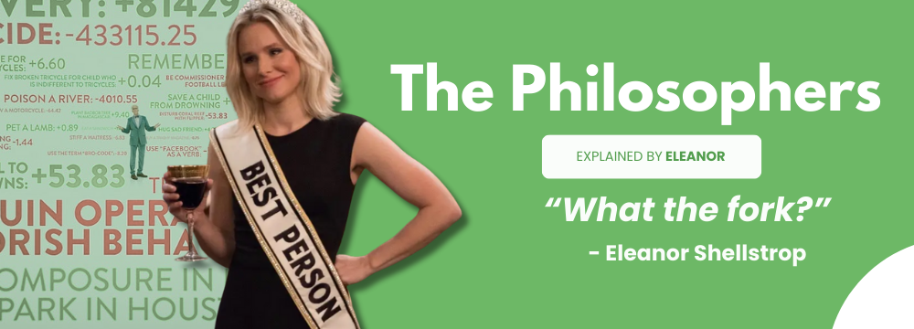
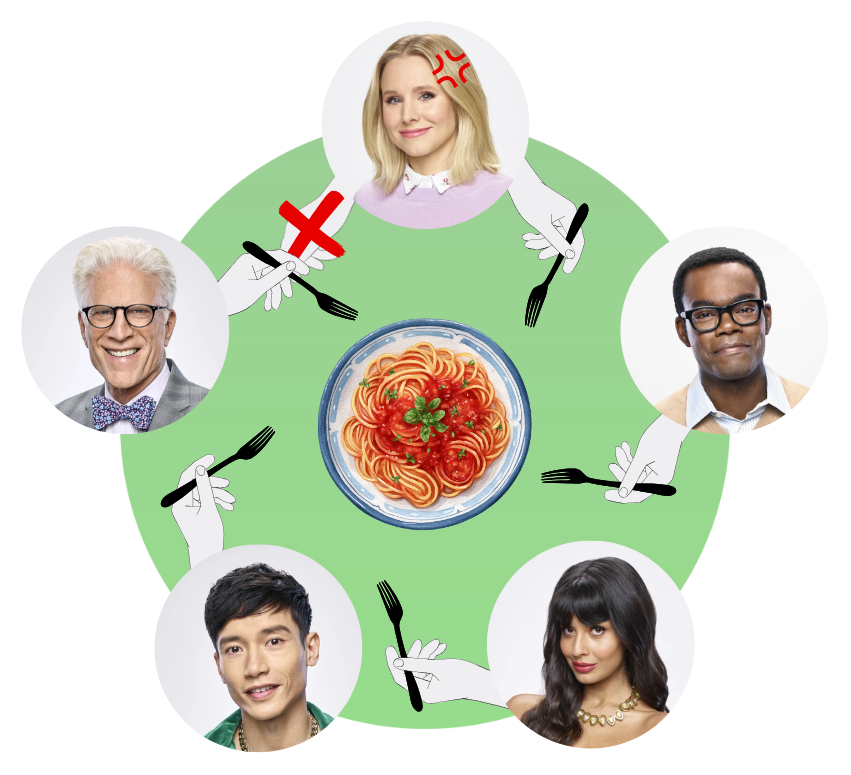
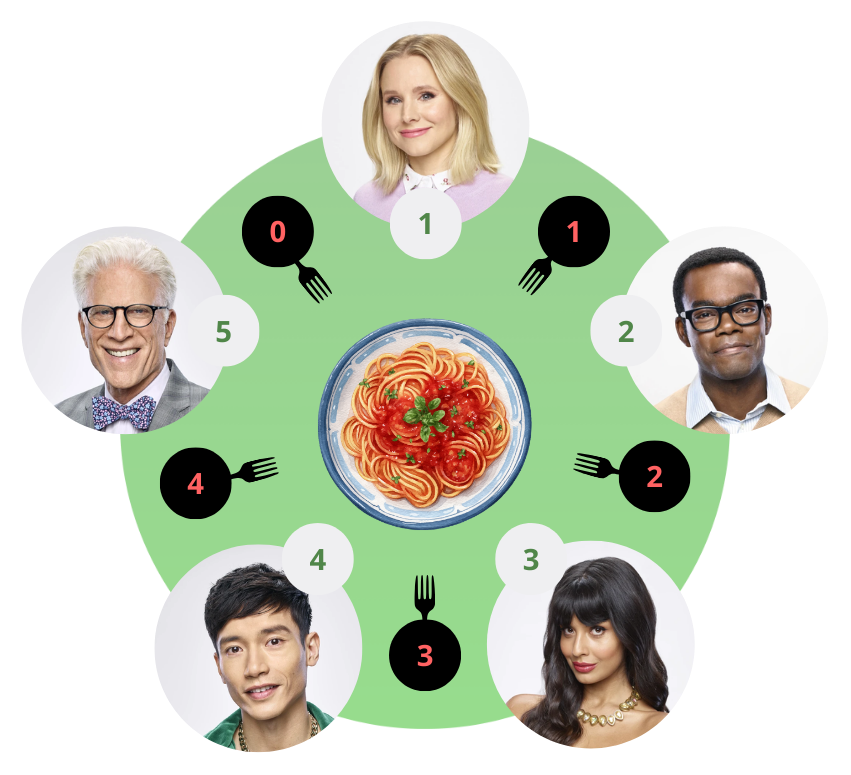
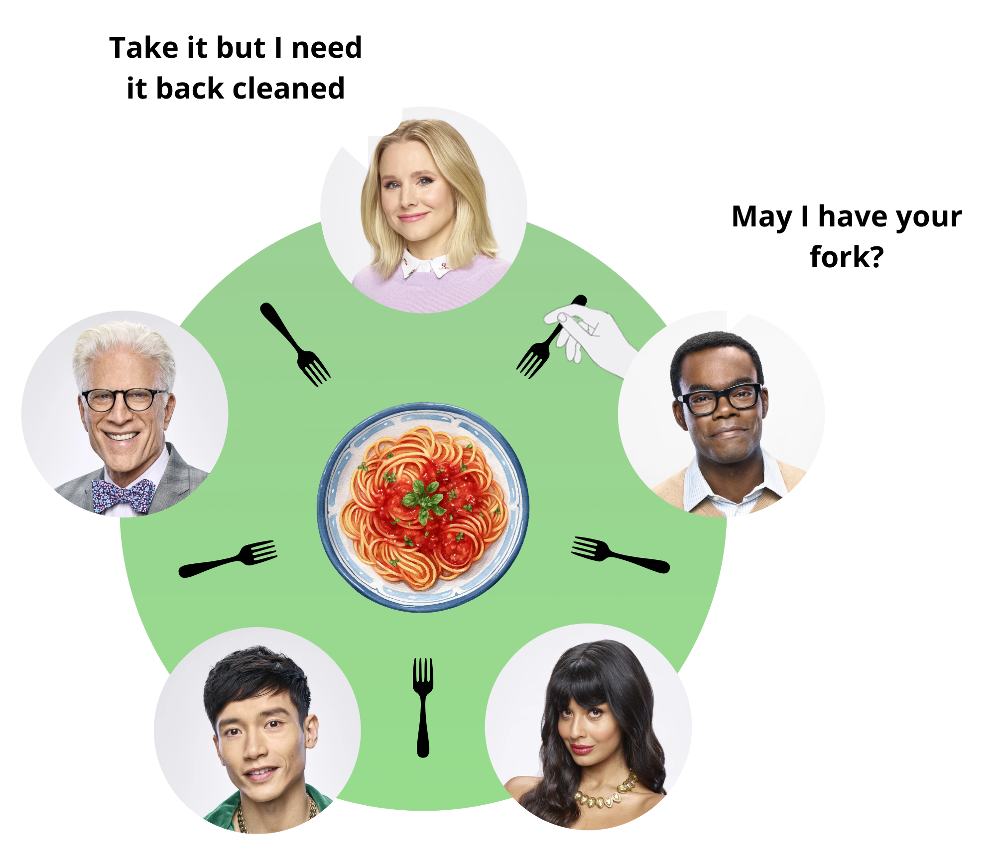
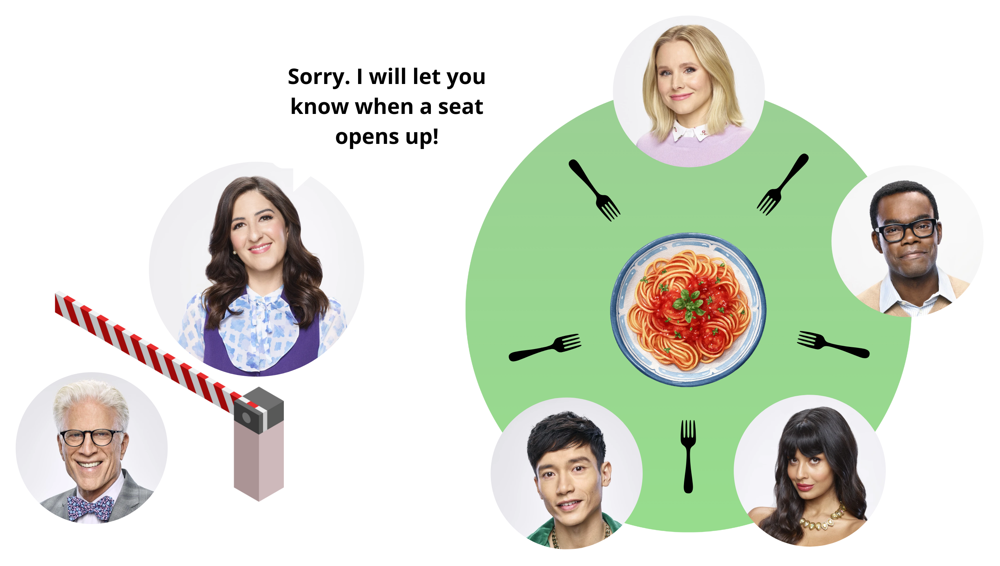

<p align="center">
  
</p>

<div align="center">

[](https://42.fr/en/homepage/)
[](https://github.com/baderelg/Philosophers) \
\
[](https://github.com/baderelg/Philosophers)
</div>

> [!NOTE]
> <details>
> <summary><strong>What is 42?</strong></summary>
>
> > [42 School](https://42.fr/en/homepage/) is a coding school focused on peer to peer learning and being project driven.\
> > We are given a project, a set of rules and clear objectives, and then it's up to us to figure out how to achieve the goal.\
> > It pushes to learn how to learn. It may be intense and sometimes frustrating but the sense of accomplishment makes everything worth it.\
> > Short term comfort is thus sacrificed for long term growth and versatility.
> </details>
>
> <details>
> <summary><strong>What is Philosophers?</strong></summary>
>
> > Philosophers is a classic concurrency challenge.\
> > The goal is to simulate the Dining Philosophers Problem using threads and mutexes.\
> > It introduces to concurrent programming, synchronization, and the subtle art of not letting everyone die.
> </details>
>
> To make the journey entertaining, I chose to approach the project through the eyes and voice of a fictional character.
>
> <details>
> <summary><strong>Why ?</strong></summary>
>
> > Embodying a character while tackling a project isn't just entertaining, it forges stronger connections with the logic and makes it way more engaging.\
> > When you try expressing what you just learned with the voice of a fictional character, it helps cementing the newly acquired knowledge and even adds new perspectives.
> >
> </details>
> <details>
> <summary><strong>Why Eleanor Shellstrop?</strong></summary>
>
> > The Dining Philosophers problem is about people dying because they can't share resources properly.\
> > In a way, it's an ethical dilemma.\
> > If anyone was going to explain how sharing and not being selfish can prevent eternal suffering, it's the character who spent four seasons learning that.
> </details>

---

<p align="center">
	
</p>

> *"Come on in."*

Look. When I first heard of "Dining Philosophers" I pictured some dinner party where everyone debates whether the salad fork is really a fork or just a social construct. But nah. Turns out it's about actual life and death.

Sit down and grab some frozen yogurt.\
I'm going to explain this whole mess until you understand concurrent programming or you'll wish you were in the Bad Place.\
<sub>Spoiler: they're basically the same thing.</sub>

<table align="center">
	<tr>
	<td align="left"><ins>Concurrent dining scenario</ins><br>
	The simulation must be written in C using threads and mutexes<br>
	Each philosopher is a thread, each fork is a mutex<br><br>
	Allowed functions: <code>memset</code>, <code>printf</code>, <code>malloc</code>, <code>free</code>, <code>write</code>, <code>usleep</code>, <code>gettimeofday</code>, <code>pthread_create</code>, <code>pthread_detach</code>, <code>pthread_join</code>, <code>pthread_mutex_init</code>, <code>pthread_mutex_destroy</code>, <code>pthread_mutex_lock</code>, <code>pthread_mutex_unlock</code><br><br>
	Arguments: <code>number_of_philosophers</code> <code>time_to_die</code> <code>time_to_eat</code> <code>time_to_sleep</code> [<code>number_of_times_each_philosopher_must_eat</code>]<br><br>
	No philosopher should die (unless the math makes it impossible)<br>
	Philosophers are not allowed to communicate with each other<br>
	Death must be announced within 10 ms<br>
	No data races. No memory leaks. No excuses<br>
	</td>
	</tr>
</table>

Ready? Let's fork this up! ... in a good way.

#  The Dining Philosophers Problem

##  Wait, this is an actual thing?

The Dining Philosophers Problem is a classic in computer science, dreamed up by *Edsger Dijkstra* in 1965.\
Yeah. The same guy who invented half of modern computing and probably never had trouble sharing pasta at dinner parties.

Here's the setup:
- Five philosophers sit at a round table.
- Between each pair of philosophers is a single fork.
- To eat, a philosopher needs two forks: the one on their left and the one on their right.
- After eating, they put the forks down and think for a while.
- Then they get hungry again.
- Repeat forever.

<p align="center">

</p>

Sounds simple, right? **Wrong.**

Here's the catch: what happens if every philosopher picks up their left fork at the same time? They're all sitting there, holding one fork, waiting for the other one to become available. But it never will, because everyone is waiting for everyone else.

That's **deadlock**. Everyone starves. Forever.

##  Why does this matter?

*"Eleanor..."* I hear you say. *"The fork do I care about some dinner party from the sixties?"*

Well, my friend, this goes well beyond philosophers or forks. This concerns any situation where multiple processes or threads need to share limited resources.

For example:
- Multiple programs trying to access the same file
- Database transactions competing for locks
- Threads in a web server fighting over memory

The Dining Philosophers is a simple model for understanding these problems. Dijkstra didn't really care about philosophers (though he did care about goto statements, like, a loooot). Through this experiment, he was trying to teach us about **concurrency** and why shared resources are kinda the equivalent of the Trolley problem for computer science.

#  How everything can go horribly wrong

##  Deadlock

Deadlock, as I said before, is when every thread is waiting for a resource that's held by another thread, forming a cycle of eternal waiting.\
<ins>In real life terms:</ins> everyone grabbed their left fork and is now waiting for their right fork. No one can eat and no one can progress. Everyone dies.

<p align="center">

</p>

### ➢ The four conditions for deadlock (Coffman Conditions)
1. **Mutual Exclusion**: Resources can't be shared (a fork can only be held by one philosopher)
2. **Hold and Wait**: A process can hold one resource while waiting for another
3. **No Preemption**: A process can't forcibly take a resource from someone
4. **Circular Wait**: A cycle of waiting exists

Break any of these conditions, and you prevent deadlock. Simple as that.

##  Race conditions

A race condition is when the outcome of a program depends on the order in which threads execute.

Imagine 2 philosophers check if a fork is available at the exact same microsecond. Both see that it's free and both grab it. Chaos follows. Variables get corrupted and the universe implodes. Okay, maybe not that last one, but your program definitely crashes.

**The solution**: Mutexes. Mutual Exclusion locks.
- Before you touch a shared resource, you lock the mutex.
- When you're done, you unlock it.
- Anyone else who wants that resource has to wait.

##  Starvation

Starvation is when a thread can make progress in theory but never gets the chance in practice. Maybe 2 philosophers have quite the appetite and the one between them never gets a turn.

Just picture being stuck in the frozen yogurt line behind someone who's trying every single flavor. Technically the line is moving. But in reality, you're never getting served.

#  How do we fix this mess?

Over the years, some genuinely brilliant people have come up with solutions. Time to review the classics!

##  Dijkstra's resource hierarchy solution

Dijkstra's original solution: **number the forks**.\
Instead of "always grab left first" philosophers grab the lower numbered fork first.

Genius, right? It breaks the circular wait!\
If everyone is trying to grab the lower numbered fork first, they can't all be waiting in a circle.\
At least one philosopher will get both forks and can eat, freeing resources for others.

### ➢ Same principle, different flow

In this implementation we used a similar strategy: even numbered philosophers grab their right fork first, while odd numbered philosophers grab their left fork first.

<p align="center">

</p>

> [!NOTE]
> - id (and fork numbers) go from 0 to N - 1
> - Philosophers are however numbered from 1 to N
> - For philosopher 1 (eleanor), id = 0 so left fork is `1` ((id + 1) % number_of_philos) and right fork is `0` (id)

```c
static void	assign_forks(t_philo *philo, t_data *data, int id)
{
	int	right;
	int	left;

	right = id;
	left = (id + 1) % data->num_philos;
	if (id % 2 == 0)
	{
		philo->first_fork = &data->forks[right];
		philo->second_fork = &data->forks[left];
	}
	else
	{
		philo->first_fork = &data->forks[left];
		philo->second_fork = &data->forks[right];
	}
}
```

No circular wait → no deadlock → no eternal suffering.

##  The Chandy/Misra Solution

> [!Warning]
> Philosophers aren't allowed to communicate with each other.
> So this solution can't be used in the 42 project.

Another interesting approach: give each fork a "dirty" or "clean" status. Philosophers pass forks around based on cleanliness. It's more complex but allows for better fairness.

<p align="center">

</p>

### How does it work?

Basically...
- At the start, every fork is dirty and given to the philosopher with the lower id.
- When a philosopher gets hungry, they send a request to each neighbor whose fork they need and the neighbor has to give up a dirty fork (but they clean it first).
- A philosopher can keep a clean fork (meaning they haven't used it yet)
- After eating, all their forks become dirty once again.

The brilliance is in **fairness**: ya can't hoard forks forever because once ya eat, your forks become dirty and you're forced to hand them over on request. No one gets permanently starved out!


##  The Conductor solution

Add a "waiter" who controls access to the table. Only N - 1 philosophers can sit at once, guaranteeing at least one can always eat.

<p align="center">

</p>

If only 4 out of 5 philosophers can try to eat at the same time, at least one pair of forks is guaranteed to be available.\
Meaning that at least 1 philosopher can always grab both forks and eat, thus breaking the deadlock cycle.

This seems valid for the project but requires an extra control mechanism.

#  This Implementation

Okay! Theory time is over. Let's talk about how this specific code actually works.

##  The Data Structures

Two main structures hold everything together:

**[`t_data`](include/philo.h#L17)** The shared simulation state
- Timing parameters (how long until death, eating time, sleeping time)
- Fork mutexes (1 per philosopher)
- Control flags (has someone died? has everyone eaten enough?)
- Synchronization primitives (barrier for coordinated start)

**[`t_philo`](include/philo.h#L41)** Each philosopher's individual state
- Their ID (1 to N)
- Meal tracking (when they last ate, how many times)
- Thread handle
- Pointers to their two forks (pre-assigned based on the ordering strategy)

##  The Barrier: Everyone must start together

A subtle but critical problem: when you create threads they don't all start at the exact same microsecond. If philosopher 1 starts and immediately begins eating, but philosopher 5 hasn't even been created yet, your timing is completely off.

That's why we set up a coordinated start.

```c
static void	wait_threads_ready(t_data *data)
{
	while (1)
	{
		pthread_mutex_lock(&data->data_lock);
		if (data->threads_ready == data->num_philos)
		{
			pthread_mutex_unlock(&data->data_lock);
			break ;
		}
		pthread_mutex_unlock(&data->data_lock);
		usleep(100);
	}
}
```

Every philosopher thread, when it starts, increments `threads_ready` and then waits for [`all_started`](src/routine.c#L81).\
Meanwhile, the main thread creates all philosophers, waits until `threads_ready == num_philos`, sets the start time, and *then* sets `all_started = 1`.

Boom. Everyone's on the same clock. Jeremy Bearimy who?

##  The main loop: Eat, ~~drink~~, sleep, think

Each philosopher's life is a simple cycle:

```c
static void	philo_loop(t_philo *philo)
{
	while (!is_sim_stopped(philo->data))
	{
		philo_eat(philo);
		if (is_sim_stopped(philo->data))
			break ;
		philo_sleep(philo);
		if (is_sim_stopped(philo->data))
			break ;
		philo_think(philo, 0);
	}
}
```

The action of eating involves:
1. Grabbing both forks (in the predetermined order!)
2. Updating the "last meal time" (needed for checking death)
3. Sleeping for `time_to_eat` milliseconds
4. Releasing both forks

The checks for `is_sim_stopped()` are important coz' if someone dies, everyone should stop <ins>immediately</ins> and not finish their current action.

##  Smart thinking time

Here's where it gets clever. Instead of waiting a random amount, the thinking phase is calculated. [`philo_think()`](src/actions.c#L80)

```c
time_since_meal = get_time_ms() - get_last_meal_time(philo);
think_time = (data->time_to_die - time_since_meal - data->time_to_eat) / 2;
if (think_time < 0)
	think_time = 0;
if (think_time > data->time_to_eat)
	think_time = data->time_to_eat;
```

Translation: "How much time do I have before I die, minus how long does it take me to eat? Take half of that."

This prevents philosophers from thinking too long and starving, while also keeping them from busy waiting and monopolizing CPU.

In case the value is too big, it gets clamped to `time_to_eat` because overthinking is how philosophers die.

> [!NOTE]
> This is also how the code reduces starvation risk (remember the frozen yogurt line example?).
> Since we are calculating exactly how long to think, no philosopher gets permanently locked out of eating.

##  Precise timing

Here is a fun one for ya: `usleep()` is a liar.

You ask it to sleep for 200 ms and it might sleep for 203 or even 210.\
On a bad day, who knows?

When `time_to_die`  is 410ms and your eat+sleep cycle is 400 ms, those extra milliseconds are the difference between life and death.

So instead of 1 big `usleep()` call, the code sleeps in small chunks, checking the elapsed time & the simulation stop flag after each one:

```c 
void	precise_wait(long ms, t_data *data)
{
	long	start;
	long	elapsed;
	long	remaining;

	start = get_time_ms();
	while (!is_sim_stopped(data))
	{
		elapsed = get_time_ms() - start;
		if (elapsed >= ms)
			break ;
		remaining = ms - elapsed;
		if (remaining > 10) // plenty of time left
			usleep(remaining * 500);
		else if (remaining > 1) // within 10 ms
			usleep(500);
		else // the final millisecond
			usleep(100);
	}
}
```
We are setting 15 alarms instead of 1. Annoying, I know, but this way we will definitely wake up on time!

<ins>The strategy here is progressive:</ins>
- When there is plenty of time left, the function sleeps for half the remaining duration *(500µs = 0.5 ms)*
- Within 10ms, it switches to 0.5ms sleeps for tighter control
- In the final millisecond, it drops to 0.1ms sleeps, a shy busy-wait that nails the deadline

##  The Monitor

The main thread becomes a monitor after starting the simulation:

```c
void	monitor_philos(t_data *data)
{
	while (1)
	{
		if (is_sim_stopped(data))
			break ;
		if (check_deaths(data))
			break ;
		if (all_ate_enough(data))
		{
			set_sim_stop(data);
			break ;
		}
		usleep(1000);
	}
	join_all_threads(data);
}
```

Every millisecond, it checks:
1. Has someone already triggered a stop?
2. Has anyone starved to death? (`current_time - last_meal_time > time_to_die`)
3. Has everyone eaten enough times? (if that argument was provided)

Rules of the subject say that death must be announced within 10ms. With a 1ms check interval and protected access to `last_meal_time`, we can hit that target with ease.

##  Protecting Everything

The thing about threads is that they are all running at the same time and could be potentially reading and writing the same memory. Without protection, you get race conditions.

With this implementation:
- **Fork access**: Each fork is a mutex. You literally can't hold a fork without locking it.
- **Meal timing**: Protected by `meal_lock` per philosopher.\
The monitor can safely read `last_meal_time` while the philosopher updates it.
- **Simulation flags**: Protected by `data_lock`.\
No race between "is someone dead?" and "someone just died!"
- **Printing**: Protected by `print_lock` AND a double-check on `sim_stop`.\
No messages print after the death announcement.

That last one is subtle but crucial. The subject says the death message should be the last one.\
So if a philosopher is about to print "is eating" but someone dies at that exact moment, they need to NOT print. That's why the solution is to check `sim_stop` while holding the print lock:

```c
void	print_status(t_philo *philo, char *msg)
{
	// First check: early return if already stopped
	pthread_mutex_lock(&philo->data->data_lock);
	if (philo->data->sim_stop)
	{
		pthread_mutex_unlock(&philo->data->data_lock);
		return ;
	}
	pthread_mutex_unlock(&philo->data->data_lock);
	// Lock the print mutex
	pthread_mutex_lock(&philo->data->print_lock);
	// Second check: someone might have died while we waited
	pthread_mutex_lock(&philo->data->data_lock);
	if (!philo->data->sim_stop)
	{
		timestamp = get_time_ms() - philo->data->start_time;
		printf("%ld %d %s\n", timestamp, philo->id, msg);
	}
	pthread_mutex_unlock(&philo->data->data_lock);
	pthread_mutex_unlock(&philo->data->print_lock);
}
```
Belt and suspenders.

##  The Single philosopher edge case

One philosopher? Doomed from the start.

```c
if (philo->data->num_philos == 1)
{
	single_philo_case(philo);
	return (NULL);
}
```

They pick up their only fork, wait `time_to_die` milliseconds, and die. Because you need two forks to eat, and there's only one. I hear ya. It's sad but inevitable...

##  Testing

<table align="center">
<tr>
	<td><code>./philo 1 800 200 200</code></td>
	<td>Dies around 800ms, never eats</td>
</tr>
<tr>
	<td><code>./philo 5 800 200 200</code></td>
	<td>No one dies</td>
</tr>
<tr>
	<td><code>./philo 5 800 200 200 7</code></td>
	<td>Stops after everyone eats 7 times</td>
</tr>
<tr>
	<td><code>./philo 4 410 200 200</code></td>
	<td>No one dies (tight margins)</td>
</tr>
<tr>
	<td><code>./philo 4 310 200 100</code></td>
	<td>Someone dies (not enough time)</td>
</tr>
</table>

For the tricky `4 410 200 200` case: 410ms to die, 200ms to eat, 200ms to sleep. Only 10ms of slack.\
The smart thinking time calculation keeps everyone alive by preventing anyone from thinking too long.

# Whenever You're Ready

Look... Concurrency is hard. Race conditions are sneaky. Deadlocks are frustrating. But here's one thing: it's also kind of... beautiful?\
All these philosophers sharing resources and staying alive because of careful decisions made beforehand.

You can't just wing it. You have to think about the systems, the rules, the interactions and probably some other things. But if you do it right, everyone gets to eat.

So... Take it sleazy, but not too much! See ya.

<p align="center">

</p>

---

<p align="center">
<sub><i>Philosophers badge © @Cadets for Cadets — used under MIT License.</i></sub>
<br>
<sub><a href="https://github.com/ayogun/42-project-badges/blob/main/LICENSE">See full license here</a></sub>
</p>
